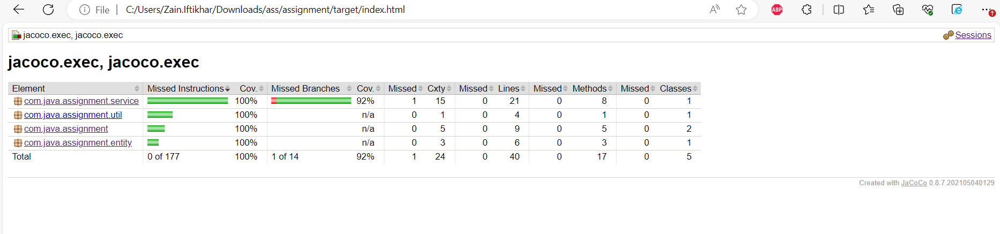
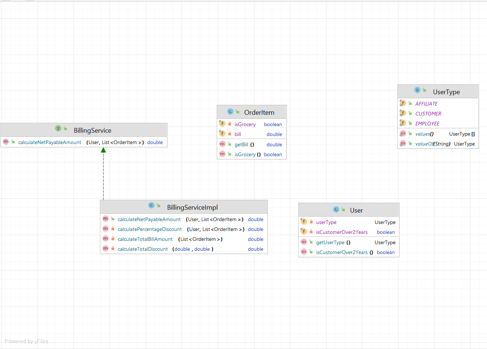

#### Assumption
- After employee type discount another 5 percent discount will be applied on total amount.
### Version Used
* Java 1.8
* Maven 3.6.3 
* Spring boot 2.7.5
* JUNIT 4.13.2 - For Testing
* jacoco 0.8.7 - For Coverage report

### Run Tests with Maven:
"mvn clean install" command. This will run the project and also execute the test as well.

### Run Tests with Maven:
  "mvn test" command. This will execute your tests and collect coverage information.

### Generate Coverage Reports:
After running the tests, JaCoCo will generate coverage reports automatically. You can find the reports in the target/site/jacoco directory of Maven project.

### Viewing Reports:
Open the generated HTML report (index.html) in a web browser to view the code coverage summary and detailed coverage information for each class.

### Class Diagram

#### Having limitation on my office laptop due to which not able to install sonarQube locally for report. 
